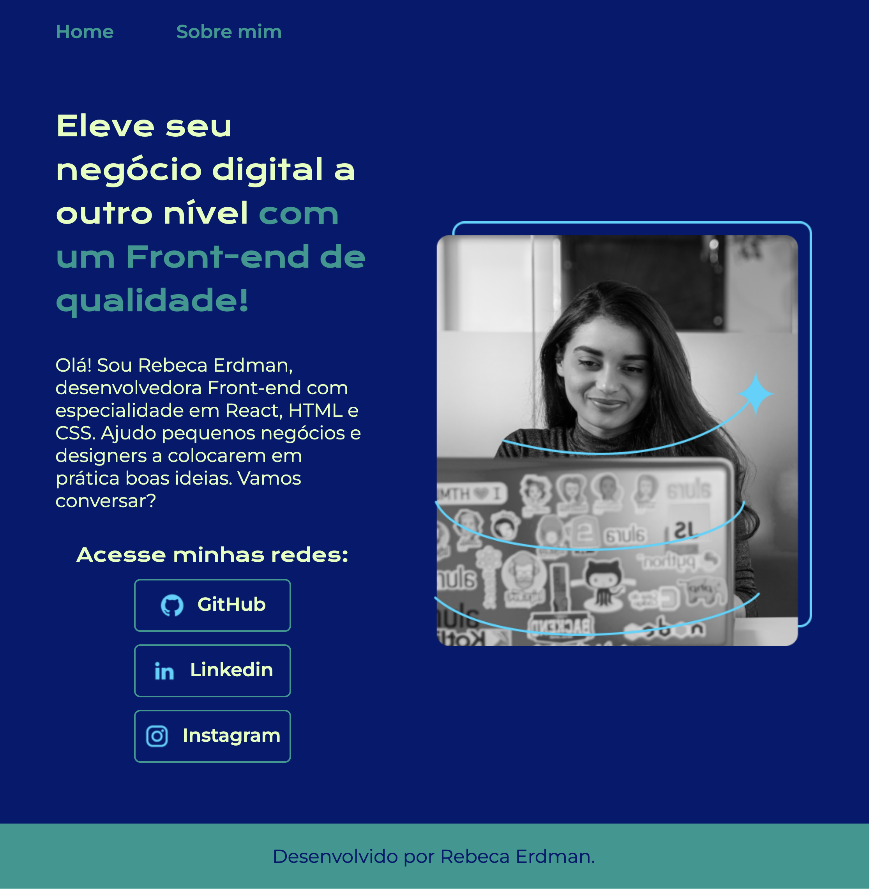

# 💻 Portfolio Project: Web Design & Interface

This project is a technical case study focused on **UI/UX and Front-end Design**. The goal was to create a modern, clean, and fully responsive interface showcasing core web development practices.

> **Live Demo:** [rebecafloriano.github.io/portfolio/](https://rebecafloriano.github.io/portfolio/)

## 🎨 About the Project

The core idea was to develop a structure that balances visual content with high usability. Key highlights include:

* **Minimalist Design:** Strategic use of white space and clear typography.
* **Responsive Interface:** A layout that adapts seamlessly to different screen sizes (desktops, tablets, and smartphones).
* **Semantic Navigation:** Code structure focused on SEO and accessibility standards.

## 🛠️ Technologies & Tools

To ensure fast loading times and optimal performance, this project uses:

* **HTML5:** Semantic and robust structure.
* **CSS3:** Advanced styling using Flexbox and Media Queries for responsiveness.
* **GitHub Pages:** Deployment and hosting infrastructure.

## ⚙️ Deployment

This project is configured with **Continuous Deployment**. Any changes pushed to the `main` branch are automatically reflected on the live URL via GitHub Pages.

---
Interface design developed by **Rebeca Floriano**
